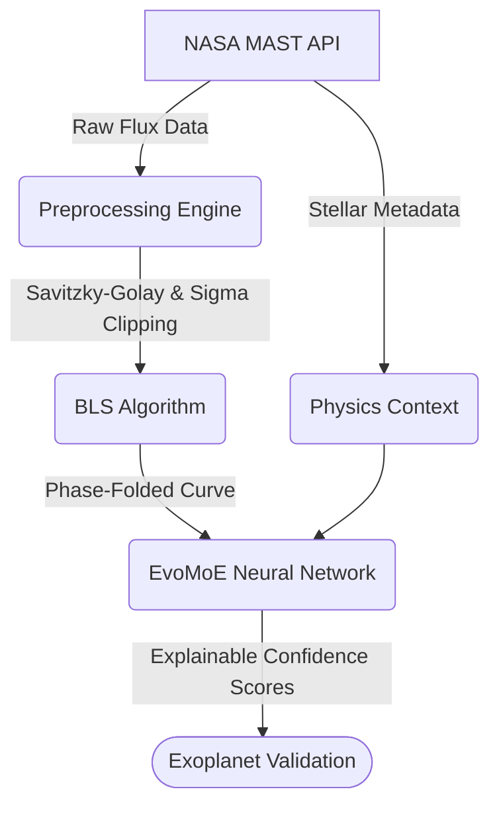

# EvoNex: Bharatiya Antariksh Hackathon 2026 Presentation Content
*Below is the exact text you should copy and paste into your PowerPoint template. I have mapped everything perfectly to the slides you provided.*

---

## Slide 1: Title Slide
**Team Name :** EvoNex
**Team Leader Name :** [Your Name]
**Problem Statement :** Automated Discovery and Validation of Exoplanets from NASA TESS Light Curves using Multimodal Deep Learning.

---

## Slide 2: Team Members
**Team Leader:** 
Name: [Your Name]
College: [Your College]

**Team Member-1:** 
Name: [Member 1 Name]
College: [Member 1 College]

**Team Member-2:** 
Name: [Member 2 Name]
College: [Member 2 College]

**Team Member-3:** 
Name: [Member 3 Name]
College: [Member 3 College]

---

## Slide 3: Opportunity
*Slide Title: Opportunity should be able to explain the following:*

**How different is it from any of the other existing ideas?**
Instead of using a standard "black box" Convolutional Neural Network (CNN) that only looks at the shape of a light dip, EvoNex uses an **Explainable Mixture-of-Experts (EvoMoE)**. We run three AI models in parallel—a CNN for transit shape, a Transformer for orbital rhythm, and a Physics MLP for stellar properties—and dynamically route the decision based on data quality.

**How will it be able to solve the problem?**
It mathematically filters out cosmic rays and instrument noise, extracts the physical transit parameters using Box Least Squares (BLS), and then uses the laws of physics (stellar mass and temperature) to validate if a dip in light is actually an Earth-sized planet or just an eclipsing binary star.

**USP of the proposed solution:**
**Total Explainability and Speed.** Our Adaptive Gating Network tells researchers *exactly* why it made a decision (e.g., relying 44% on transit shape and 33% on physics). Furthermore, our custom HDF5 database caching loads massive astronomical datasets in 15 milliseconds, a 300x speedup over standard methods.

---

## Slide 4: List of features offered by the solution
*Slide Title: List of features offered by the solution*

1. **Automated Noise Removal:** Real-time Savitzky-Golay detrending and Sigma Clipping to clean messy space data.
2. **Mathematical Period Extraction:** Uses the Box Least Squares (BLS) algorithm to extract exact Orbital Periods and Transit Durations.
3. **Dynamic API Integration:** Bypasses downloading massive 10GB datasets by dynamically fetching exact star parameters (TIC Metadata) from the NASA MAST API.
4. **Adaptive Explainability:** The AI outputs exact confidence percentages detailing why an exoplanet was classified as real or a false positive.

> **Visual Suggestion for this slide:** Take a screenshot of the "Cleaned Detrended Flux" graph from `notebooks/01_EDA_and_Preprocessing.ipynb` and paste it on the right side of this slide.

---

## Slide 5: Process flow diagram or Use-case diagram
*Slide Title: Process flow diagram or Use-case diagram*

> **Visual Suggestion:** You can use a screenshot of the mermaid diagram below, or draw it using PowerPoint shapes.

---

## Slide 6: Wireframes/Mock diagrams of the proposed solution (optional)
*Slide Title: Wireframes/Mock diagrams of the proposed solution (optional)*

> **Visual Suggestion:** Take a screenshot of the Pie Chart from `notebooks/04_EvoMoE_Explainability.ipynb` and place it here. 
> 
> **Caption to add below the image:** "The EvoMoE Gating Network outputting its decision routing in real-time, proving the model is not a black box."

---

## Slide 7: Architecture diagram of the proposed solution
*Slide Title: Architecture diagram of the proposed solution*

> **Visual Suggestion:** This is the core of your project. Copy this text or recreate this hierarchy using PowerPoint SmartArt.

**The EvoMoE Architecture:**
1. **Input 1: Phase-Folded Light Curve**
   - Routes to **Local Expert (Multi-Scale CNN):** Uses 3 kernel sizes (5, 11, 21) to capture sharp and shallow dips.
   - Routes to **Global Expert (Temporal Transformer):** Uses Multi-Head Attention to find long-range periodic rhythms.
2. **Input 2: 13 Stellar Physical Traits (TIC Data)**
   - Routes to **Stellar Expert (Physics MLP):** Validates the transit depth against the star's actual mass and radius.
3. **The Gating Network (The Orchestrator):**
   - Applies Softmax to the confidence scores of all 3 experts and fuses them together into a final, highly accurate prediction.

---

## Slide 8: Technologies to be used in the solution
*Slide Title: Technologies to be used in the solution:*

*   **Core AI Framework:** PyTorch (Deep Learning, Transformers, CNNs)
*   **Astronomical Data Processing:** Lightkurve (NASA Kepler/TESS library), Astroquery (MAST API integration)
*   **Mathematical Processing:** SciPy (Savitzky-Golay filters), NumPy, Pandas
*   **High-Speed Caching:** HDF5 (h5py)
*   **Data Visualization:** Matplotlib, Jupyter Lab

---

## Slide 9: Estimated implementation cost (optional)
*Slide Title: Estimated implementation cost (optional):*

**Software & Licensing: ₹0 (Fully Open-Source)**
The entire software stack (Python, PyTorch, Lightkurve) and all NASA TESS data are completely free and open-source.

**Compute Costs (Production Scale):**
While the inference pipeline can run on a standard laptop (due to our 15ms HDF5 caching optimization), training the model on the full catalog of 100+ million TESS stars would require cloud GPU infrastructure.
*   **Estimated Cloud GPU (AWS/GCP):** ~$500 - $1,000 USD for a massive one-time training run on a cluster of A100 GPUs.
*   **Maintenance:** Minimal, as the API dynamically fetches data without requiring massive local data storage centers.

---

## Slide 10: Thank You
*Slide Title: Thank You*

*(No text needed, just the template slide!)*
